# SQL & Query Plan 

## Twitter-Q1

### SQL:

### QueryPlan: 

#### HyMJ-H:

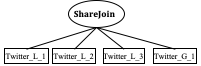

#### HyMJ-E:

## Twitter-Q2

### SQL:

### QueryPlan: 

#### HyMJ-H:

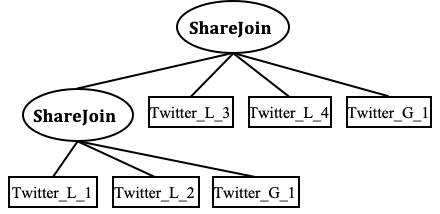

#### HyMJ-E:

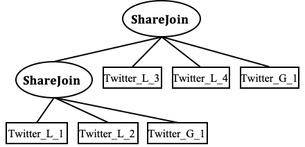

## Twitter-Q3

### SQL:

### QueryPlan: 

#### HyMJ-H:

#### HyMJ-E:

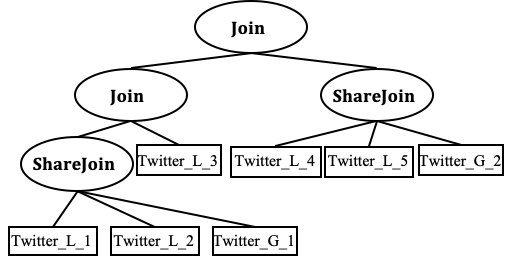

## PPI-Q1

### SQL:

### QueryPlan: 

#### HyMJ-H:

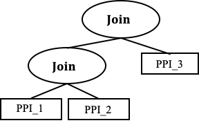

#### HyMJ-E:

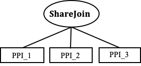

## PPI-Q2

### SQL:

### QueryPlan: 

#### HyMJ-H:

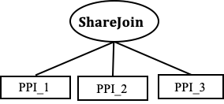

#### HyMJ-E:

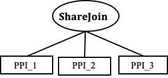

## PPI-Q3

### SQL:

### QueryPlan: 

#### HyMJ-H:

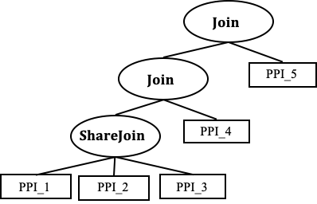

#### HyMJ-E:

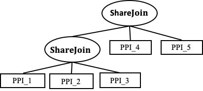

## DBLP-Q1

### SQL:

### QueryPlan: 

#### HyMJ-H:

#### HyMJ-E:

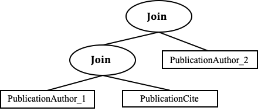

## DBLP-Q2

### SQL:

### QueryPlan: 

#### HyMJ-H:

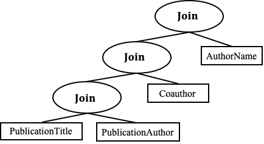

#### HyMJ-E:

## DBLP-Q3

### SQL:

### QueryPlan:

#### HyMJ-H:

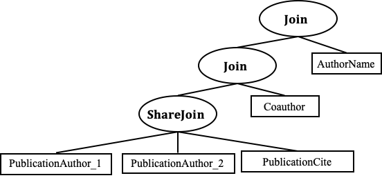

#### HyMJ-E: 

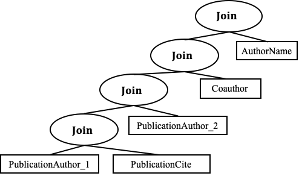